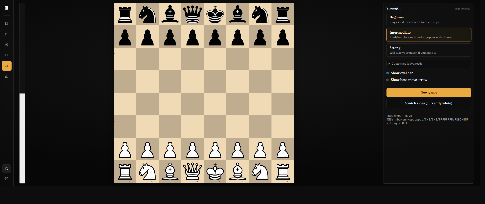
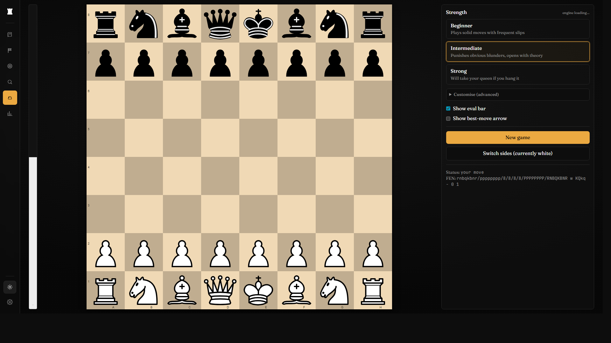
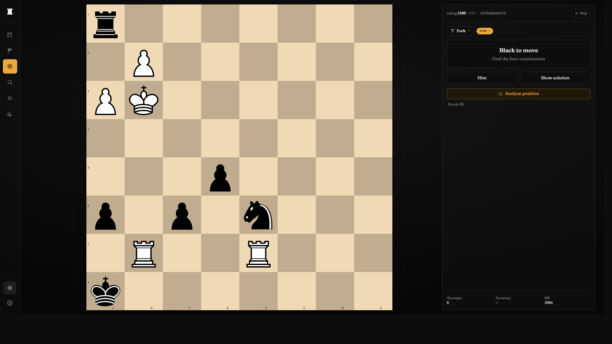
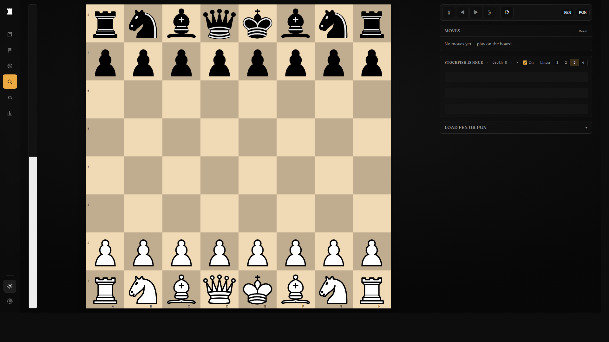
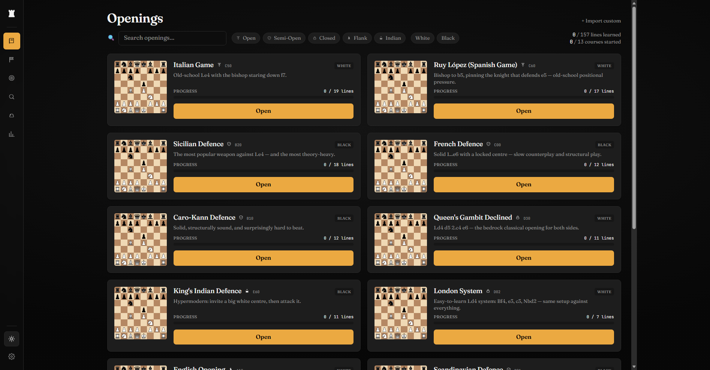
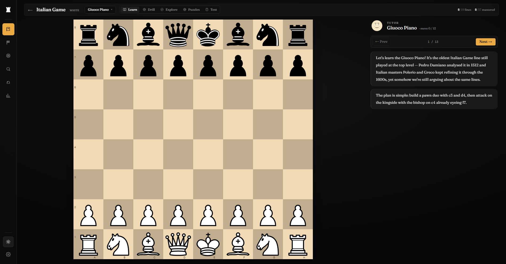
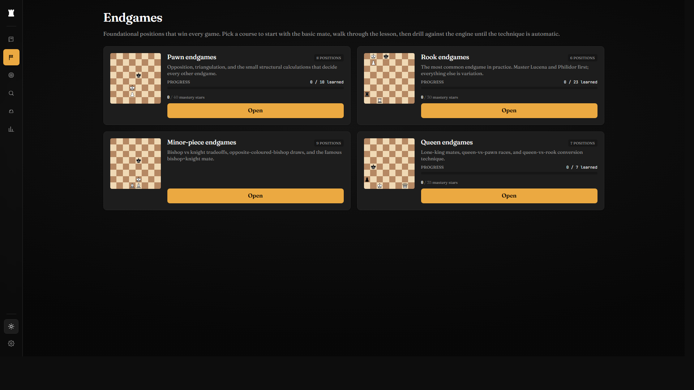
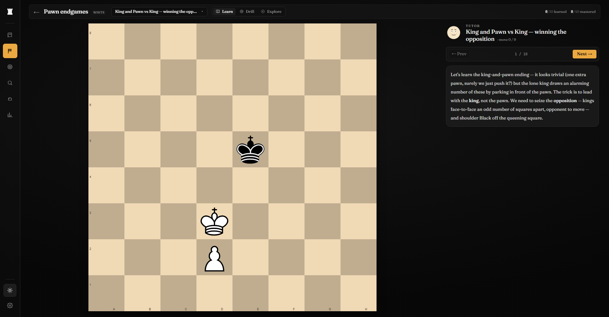

# LearnChess



I didn't want to pay to practice openings so I made something myself, using claude code, which costs way more, but I had it anyway so it's fine!!

## What it is

A self-hosted chess learning app you run in a browser. No accounts, no subscriptions, no telemetry. Four pillars:

- **Play** — face Stockfish at five strength presets, from "blunders for fun" to ~3000 Elo.
- **Tactics** — solve real Lichess puzzles, ratings move with you (Glicko-lite), filter by theme or opening.
- **Openings** — drill a curated repertoire (13 named openings, 96 tabiyas) with spaced repetition.
- **Endgames** — work through canonical endings, graded by Lichess's tablebase.

Everything runs in the browser. Per-user state (puzzle history, opening progress, ratings) lives in IndexedDB. The only external call is the Lichess tablebase API for endgame verdicts — and that's read-only, no auth, fine to run offline-mostly behind a homelab reverse proxy.

## How it works

| Piece | What does the work |
|---|---|
| Board rendering | [chessground](https://github.com/lichess-org/chessground) (the Lichess board library) |
| Move legality | [chess.js](https://github.com/jhlywa/chess.js) |
| Engine | Stockfish 16 NNUE WASM, in a Web Worker, talking UCI |
| Tactics DB | 200k Lichess puzzles in a Brotli-compressed SQLite shipped as a static asset, loaded in-browser via sqlite-wasm |
| Endgame verdicts | Lichess tablebase API (`tablebase.lichess.ovh`) |
| Opening drill scheduler | SM-2-lite (deck-aware spaced repetition) |
| Persistence | IndexedDB via [idb](https://github.com/jakearchibald/idb), schemas migrated forwards |

The puzzle DB is built at Docker-build time from the [Lichess puzzle dump](https://database.lichess.org/) (CC0). 5.8M raw puzzles get pruned to 200k balanced across rating bands and major themes — enough to never repeat for a normal session, small enough to fit in browser memory.

Stockfish runs single-threaded so we don't need cross-origin isolation headers (COOP/COEP), which means you can drop this behind any reverse proxy without fighting CSP.

## Play



Pick a strength, hit New Game, play. Move a piece by drag or click-click. The eval bar on the left tracks who's ahead in real time.

## Tactics



Puzzles pulled from Lichess. Your rating updates after each attempt with a Glicko-lite calc — solve harder than your rating, you go up; miss something at your level, you go down. Filter by theme (forks, pins, mating patterns, etc.) or by opening. Already-attempted puzzles are excluded from selection so you keep seeing fresh content.

## Analysis



Paste a FEN or PGN, walk through the moves, watch Stockfish chew on it. Three multi-PV lines, eval, depth, and the principal variation as clickable move chips.

## Openings



13 hand-curated repertoires across both sides. Each course is broken into named tabiyas — the recognisable pause-points where the opening stops being theory and starts being a real game. Italian, Spanish, Sicilian, French, Caro-Kann, QGD, KID, London, English, Scandinavian, Pirc, Slav, Vienna.



Three modes per course:

- **Learn** — read the prose for each tabiya: White's plan, Black's plan, key squares, tactical themes. The text drives on-board square highlights so you see the idea, not just read about it.
- **Drill** — the trainer plays the opponent, you play your side, the scheduler picks lines based on what you've forgotten. Wrong move = auto-undo with a red flash, no "press the X button" friction.
- **Test** — multiple-choice and click-the-key-square questions auto-generated from the tabiya prose. Spaced-repetition scheduled per card.

There's also a **Puzzles** tab inside each course that filters the tactics DB to puzzles arising from that opening's positions, so the tactical patterns you drill match the structures you actually play.

## Endgames



Five courses: Pawn, Rook, Minor-piece, Queen, and Misc endgames. Each course is a sequence of canonical positions — the ones that show up in real games, not contrived studies.



Same three-mode structure as openings. **Learn** walks through the technique step-by-step with prose and key-square highlights. **Drill** asks you to find the moves yourself; verdicts come from the Lichess tablebase, so the grading is ground-truth. **Explore** lets you make any move and see the engine + tablebase response — useful for "what if I'd played X instead?"

## Quick start (development)

```bash
git clone https://github.com/George-Nizor/LearnChess.git
cd LearnChess
npm install
npm run setup       # downloads Stockfish (~85 MB) + Lichess puzzle CSV (~280 MB → 55 MB DB) + sounds + piece sets. Idempotent.
npm run dev         # http://localhost:5173
```

If you skip `setup`, the dev server still boots — but Play, Analysis, Tactics, and the Openings → Puzzles tab are unavailable until the engine and puzzle DB are vendored. A banner at the top of the app tells you which command to run.

The engine and puzzle DB are not committed (too large, regenerable). Run `npm run setup` once per fresh clone.

### Other npm scripts

```
npm run typecheck     # tsc --noEmit (strict; exactOptionalPropertyTypes; verbatimModuleSyntax)
npm run lint          # eslint --max-warnings 0
npm run test          # vitest
npm run test:e2e      # playwright (chromium)
npm run build         # production bundle into dist/ (~150 MB)
npm run preview       # serve the production build locally
```

## Self-hosting on a homelab

Three-stage Docker build (Node build → Brotli pre-compression → Alpine nginx-with-brotli) plus a `docker-compose.yml` that drops the container behind any reverse proxy:

```bash
docker compose up -d --build
```

The build pulls Stockfish from npm, downloads the Lichess puzzle dump, prunes it to 200k puzzles, and bakes everything into a static-asset image. **No runtime data fetches needed.** The container ships read-only, listens on port 8080, and uses ~256 MB of RAM at idle.

Build time on a typical machine: ~4 minutes (the puzzle download is the slow step). Image size: ~250 MB compressed.

If you don't already have a reverse proxy, uncomment the standalone Caddy profile in `docker-compose.yml`:

```bash
CADDY_DOMAIN=chess.example.com docker compose --profile standalone up -d
```

Caddy handles HTTPS via Let's Encrypt automatically. Full notes — cache headers, build-time network requirements, multi-thread Stockfish upgrade path — in [`docs/DEPLOY.md`](docs/DEPLOY.md).

### Build-time network requirements

The Docker build needs outbound network for:

- npm registry (deps)
- `github.com` for the Stockfish WASM artefacts
- `database.lichess.org` for the puzzle CSV (~280 MB, fetched once per build)

Run-time network is **optional** — only the Endgames pillar pings `tablebase.lichess.ovh` for verdicts. Everything else works fully offline after the first asset load.

The CSV download is cached across builds via a BuildKit cache mount, so monthly rebuilds skip the 280 MB re-fetch. Run `docker builder prune` when you actually want a fresh dump (Lichess refreshes the dataset monthly).

### Air-gapped or flaky-network builds (`PUZZLE_DUMP_PATH`)

If your build host can't reach `database.lichess.org` — common on segmented homelab networks, behind a corporate proxy, or when undici hangs against your DNS setup — stage the dump out-of-band:

```bash
# On a machine that CAN reach Lichess:
curl -L -o lichess_db_puzzle.csv.zst \
  https://database.lichess.org/lichess_db_puzzle.csv.zst

# Drop it into .cache/ before building. The build:puzzles script
# auto-detects and reuses existing files at this path:
mkdir -p .cache
mv lichess_db_puzzle.csv.zst .cache/
docker compose build
```

Alternatively, set `PUZZLE_DUMP_PATH` to point at a file anywhere on the build host and the script copies it into `.cache/` for you. If the env var is set but the file doesn't exist, the build errors out with a clear message rather than silently falling back to the network — opt-out is explicit.

## Architecture

```
src/
├── routes/              # Play, Tactics, Openings, Endgames, Analysis, Dashboard, Settings
├── chess/
│   ├── board/           # chessground React wrapper
│   ├── engine/          # Stockfish UCI worker bridge
│   ├── rules/           # chess.js wrappers + types
│   ├── tablebase/       # Lichess tablebase client
│   └── openings/        # offline opening book (move graph)
├── openings/
│   ├── lessons.ts       # 96 tabiyas across 13 opening courses
│   ├── proseParser.ts   # parses tabiya prose into typed sections + tokens
│   ├── testQuestions.ts # auto-generates Test-mode questions
│   ├── drillSession.ts  # SRS-backed Drill-mode scheduler
│   ├── lineSelector.ts  # spaced drill-line selection
│   ├── scheduler.ts     # SM-2-lite SRS algorithm
│   └── db.ts            # IndexedDB (repertoires, moves, lineProgress, testCards)
├── puzzles/             # tactics: db, scheduler, rating, themes
├── components/ui/       # shared React primitives
├── persistence/         # IDB wrapper for tactics + endgames
├── state/               # zustand stores
└── styles/globals.css   # Tailwind v4 entry + theme tokens
```

`docs/` holds the research briefs that locked the stack ([`stack.md`](docs/research/stack.md), [`puzzle-db.md`](docs/research/puzzle-db.md), [`competitor-deep-dive.md`](docs/research/competitor-deep-dive.md)) and [`DEPLOY.md`](docs/DEPLOY.md). [`CLAUDE.md`](CLAUDE.md) is the architectural-decision log.

## Stack

| Layer | Pick | Version |
|---|---|---|
| Build | Vite | 6 |
| UI | React + TypeScript strict | 19 |
| Styling | Tailwind 4 (Oxide) + shadcn/ui primitives | 4 |
| Board | chessground | 9.2 |
| Move engine | chess.js | 1.x |
| Engine | Stockfish 16 NNUE WASM (single-thread) | 16 |
| State | zustand (UI) + idb (persistence) | 5 / 8 |
| Tactics DB | sqlite-wasm + Brotli static asset | latest |

Full reasoning per pick — and the alternatives that didn't make it — in [`docs/research/stack.md`](docs/research/stack.md).

## License

GPL-3.0-or-later. Forced by chessground (GPL bundled into the JS). Stockfish is also GPL but ships as an isolated WASM worker, so the licensing boundary is clean — see [`LICENSES.md`](LICENSES.md) for the isolation pattern.

## Acknowledgements

- [Lichess](https://lichess.org) — puzzle dump (CC0), tablebase, and the chessground/Stockfish work the whole open-source chess world rides on
- [chess.js](https://github.com/jhlywa/chess.js) — move generator
- [chessdriller](https://github.com/gtim/chessdriller) — opening drill UX inspiration
- [Chessable](https://www.chessable.com), [chessreps](https://chessreps.com), [Listudy](https://listudy.org) — competitor research that shaped the line picker + Learn mode
