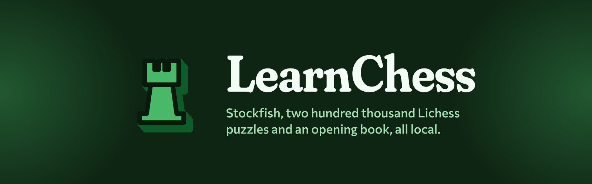

<p align="center"></p>

# LearnChess

Stockfish, two hundred thousand Lichess puzzles and an opening book, all local. The endgame trainer
asks the Lichess tablebase for verdicts.

I didn't want to pay to practice openings so I made something myself, using claude code, which costs
way more, but I had it anyway so it's fine!!

LearnChess is a chess training app that runs in the browser. It has no accounts, no backend and no
telemetry. It is the chess learning app in the Instrumenta suite and also runs on its own.

Current version: **0.2.0**.

## What it has

**Play.** Play Stockfish 16 (NNUE, single-threaded WASM in a Web Worker) at Beginner, Intermediate
or Strong, or set the skill level (0 to 20) and think time yourself. An eval bar and a best-move
arrow are optional.

**Tactics.** Lichess puzzles from a local SQLite database, read in the browser with sqlite-wasm.
Filter by theme or by opening. A Glicko-1 style rating moves after each attempt, and puzzles you have
already tried are skipped until the filter runs out of new ones.

**Openings.** 14 courses: Italian, Ruy Lopez, Scotch, Sicilian, Caro-Kann, French, Queen's Gambit
Declined, King's Indian, London, English, Scandinavian, Pirc, Slav and Vienna. They hold 200 lines,
61 of which are deviations from a main line. Each course has five modes:

- **Learn** walks through a line with notes that highlight squares on the board.
- **Drill** plays the other side while you play yours; an SM-2-lite scheduler picks the lines that
  are due, and a wrong move is taken back.
- **Test** asks multiple-choice and click-the-key-square questions generated from the lesson text.
- **Puzzles** filters the tactics database to that opening.
- **Explore** opens the line in the analysis board.

You can also import your own repertoire from pasted PGN or a public Lichess study.

**Endgames.** 31 positions in four courses: pawn, rook, minor piece and queen endings. Drill plays
the other side with the Lichess tablebase's best reply (Stockfish if the tablebase cannot be
reached) and grades your moves by the tablebase verdict. Five positions (king and pawn against king,
Lucena, Philidor, and the basic queen and rook mates) also have a step-by-step Learn walkthrough; the
rest are Drill only for now. Explore opens the position in the analysis board.

**Analysis.** Load a FEN or PGN, step through the moves, and read one to four Stockfish lines (three
by default) with evaluation and depth.

The dashboard shows your tactics rating, accuracy, endgame results and 30-day charts. Settings has
light, dark and automatic themes, five board colours, three piece sets, four sound packs, and a
button that wipes local progress.

The layout assumes a desktop-width window. The phone layout is unfinished; the plan is in
[`docs/MOBILE_PLAN.md`](docs/MOBILE_PLAN.md).

## Requirements

Node.js 22.12 or newer and npm. `npm run setup` needs network access to `raw.githubusercontent.com`
(piece sets, opening names) and `database.lichess.org` (the puzzle dump, about 280 MB, fetched with
`wget`). In use, only the endgame trainer and the Lichess study import reach the network.

## Run it

```bash
git clone https://github.com/George-Nizor/LearnChess.git
cd LearnChess
npm install
npm run setup
npm run dev
```

The dev server listens on `http://localhost:5173`. `npm run setup` copies Stockfish and the SQLite
WASM out of `node_modules`, generates the sounds, downloads the piece sets and opening names, then
builds `public/puzzles.db` (about 55 MB) from the Lichess puzzle dump. It is safe to run again.
Without it the app still starts, but Play, Analysis and Tactics stay unavailable and a banner names
the missing files.

`npm run build:puzzles` reuses `.cache/lichess_db_puzzle.csv.zst` if it exists, or copies the dump
from the path in `PUZZLE_DUMP_PATH`, so a host that cannot reach Lichess can use a dump fetched
elsewhere.

`npm run build` writes `dist/` (about 150 MB, most of it the engine networks and puzzles) and
`npm run preview` serves it.

## Self-hosting with Docker

```bash
docker compose up -d --build
```

The image builds the app, pre-compresses it, and serves it from nginx on port 8080 (set
`LEARNCHESS_PORT` to change the host port) in a read-only container limited to 256 MB of memory. The
build downloads the puzzle dump from `database.lichess.org` and keeps it in a BuildKit cache;
`.cache/` and `PUZZLE_DUMP_PATH` are not used inside Docker. `docker-compose.yml` has a commented-out
Caddy service for HTTPS without an existing reverse proxy. [`docs/DEPLOY.md`](docs/DEPLOY.md) covers
HTTPS, cache headers and the multi-threaded engine option.

## Where data lives

Progress stays in the browser's IndexedDB for the page's origin, in three databases: `learnchess`
(puzzle attempts, ratings, endgame attempts), `learnchess-openings` (repertoires, drill and test
progress) and `learnchess-endgames` (Learn progress). Theme, board, piece set and sound choices are
in `localStorage`. Nothing is synced; Settings has the wipe button.

## Instrumenta and releases

[`instrumenta/product.json`](instrumenta/product.json) builds LearnChess as `web-vite`; the launcher
delivers it as `managed-web` and opens it on `127.0.0.1:49324` in a sandboxed window. A fresh
Instrumenta install starts from the copy bundled with the launcher and then updates from LearnChess's
GitHub releases. Pushing a `v<version>` tag runs
[`.github/workflows/release.yml`](.github/workflows/release.yml), which calls Instrumenta's shared web
product release workflow.

The launcher's Content-Security-Policy allows one outside host, `tablebase.lichess.ovh`, so the
Lichess study import does not work there. Paste the study's PGN instead.

## Development

```bash
npm run typecheck
npm run lint
npm test
npm run test:e2e
```

`npm test` runs Vitest; `npm run test:e2e` runs Playwright in Chromium. CI runs typecheck, lint and
unit tests, then builds the Docker image. The stack and the reasons for each pick are in
[`docs/research/stack.md`](docs/research/stack.md).

## Licence

GPL-3.0-or-later ([LICENSE](LICENSE)), required by chessground, which is bundled. Stockfish (GPL-3.0)
runs as a separate worker. [`LICENSES.md`](LICENSES.md) lists the bundled code, piece sets, fonts and
data (the Lichess puzzle database is CC0) and how to get the corresponding source.

## Family

LearnChess is part of [Instrumenta](https://github.com/George-Nizor/Instrumenta), a suite of local
learning and creative apps made by [Bonehead Labs](https://boneheadlabs.org)
([GitHub](https://github.com/Bonehead-Labs)). It follows the Instrumenta brand v2: a green rook,
drawn as a freestanding object. The interface type (Fraunces, Commissioner, Spline Sans Mono) is SIL
OFL 1.1, vendored in `public/fonts/brand` with its licences. Licence: GPL-3.0-or-later.
